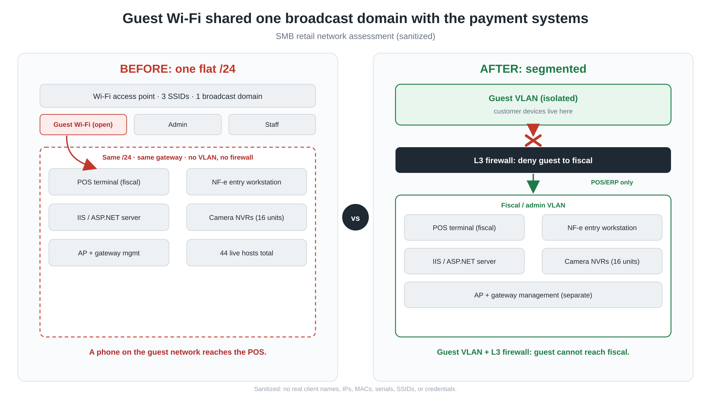

# Flat Network, Fiscal Risk: Finding a Critical Segmentation Gap in an SMB Retail Assessment

> An authorized internal network assessment of a small business, and how a single missing boundary (guest WiFi sharing one broadcast domain with the payment and fiscal systems) turned "anyone with a phone in the waiting area" into a direct path to the point-of-sale terminals.

**Author:** le0n3das · Security & infrastructure consultant (networks / Linux / SMB security)
**Type:** Internal network penetration test (assumed-breach, authenticated WiFi client)
**Client:** a multi-store auto-parts retailer (SMB) in Brazil, anonymized with the owner's consent

---

## Context

Small businesses rarely have a deliberate network segmentation policy. The topology is usually whatever the ISP technician and the camera installer left behind over the years. This one was typical: a single consumer-grade ISP gateway, one enterprise-class WiFi access point broadcasting multiple SSIDs, and a mix of Windows point-of-sale machines, fiscal note-entry workstations, an IIS server, and a fleet of IP-camera recorders, all bought and wired over several years by different people.

The owner-operator authorized an internal assessment of the WiFi network. This writeup covers the finding that carried the engagement: the flat network. All client-identifying data (names, IP addresses, MAC addresses, device serials, SSIDs, credentials) has been removed or generalized. The methodology and the fix are kept intact.

## Scope and rules of engagement

- **Authorization:** explicit, from the owner-operator. This was a contracted assessment, not opportunistic testing.
- **Position:** assumed-breach. I tested as an authenticated WiFi client, then re-tested from the open public guest SSID, which is the realistic worst case for a walk-in retail store.
- **Target:** the internal WiFi network, a single RFC 1918 /24.
- **Intrusion level:** standard, non-destructive. No LLMNR/NBT-NS/mDNS poisoning, no NTLM relay, no brute force beyond a top-10 default-credential check, and no exploit that could crash embedded/IoT devices. The goal was to prove reachability and risk, not to own the network.
- **Toolchain:** a containerized Kali-based tooling stack with an active scope guard. Core tools used for this finding: `arp-scan` and `nmap`, plus `curl` for service fingerprinting.

## Methodology

1. **Discovery.** `arp-scan` on the local segment inventoried the live hosts. A flat /24 with dozens of live hosts is the first smell: payment terminals, cameras, and an access point all answering on the same broadcast domain.
2. **Enumeration.** `nmap` (curated TCP ports, no `-Pn` per the wrapper's limits) plus `curl -I` for HTTP banners. This mapped roles: fiscal POS terminals, an IIS/ASP.NET host, a note-entry workstation, the WiFi AP's management SSH, and a large set of camera DVR/NVR web panels.
3. **The pivot that proved the finding.** I disassociated from the admin SSID and re-associated to the **open, passwordless guest SSID**. The DHCP lease I received was identical: same /24, same default gateway, same gateway MAC. From a network any customer can join, I had a Layer 3 path to every fiscal and administrative host.

## The finding: no Layer 3 isolation between guest WiFi and the fiscal segment

**Severity: Critical.** (CVSS 3.1 base 9.4: AV:A / AC:L / PR:N / UI:N / S:C / C:H / I:H / A:H)
**MITRE ATT&CK:** T1133 (External Remote Services), T1078 (Valid Accounts), T1021 (Remote Services)

The public guest SSID handed out addresses on the *same* subnet, *same* gateway, and *same* broadcast domain as the administrative SSID and the entire fiscal infrastructure. There was no VLAN, no L3 firewall, no router ACL, and no client isolation between the two.

From an anonymous association to the open guest network, the following were directly reachable (results generalized):

| Target (role) | Probe | Result |
|---|---|---|
| Fiscal POS host running IIS | `curl -I http://<pos-host>/` | `HTTP/1.1 200 OK · Server: Microsoft-IIS/10.0 · X-Powered-By: ASP.NET` |
| Same host, SMB surface | `nmap -p 80,135,139,445 <pos-host>` | `80/open 135/open 139/open 445/open` |
| Camera NVR | `curl -I http://<nvr-host>/` | `301 → https://<nvr-host>:443/` |
| WiFi AP management | `nmap -p 22 <ap-host>` | `22/open ssh` |

A customer sitting in the waiting area, with nothing but a phone, could reach the machines that process payments and fiscal documents.

### Why this one finding amplifies everything else

The assessment turned up the usual SMB fleet issues: SMB signing enabled but not required across every Windows host, an end-of-life Windows 10 build (unsupported for 4+ years, so unpatched against known RCE/LPE CVEs), unauthenticated device-serial disclosure on the camera fleet, and NetBIOS hostnames that broadcast each machine's fiscal role to anyone scanning.

On a properly segmented network, most of those stay "internal attacker" problems. The flat network is the multiplier: it converts every one of them into an "any walk-in with a phone" problem. That multiplier is why the segmentation gap is rated Critical while the fleet issues are High/Medium. Segmentation is the control that decides who is even in scope to exploit the others.

### Plausible chain (under 30 minutes, no custom tooling)

1. Sit down, join the open guest WiFi.
2. Receive a lease on the fiscal /24.
3. `nmap` the /24, identify the POS and note-entry hosts by their leaked roles.
4. Attempt SMB coercion/relay (signing not required) or target the EOL Windows CVEs.
5. If that stalls, pivot to the camera DVRs (default-credential surface) for CCTV access.

Even where no immediate RCE lands, the open L3 path itself is a serious violation of segmentation principle for a business that handles payments and tax documents.

## Remediation (as delivered, prioritized)

**Immediate**
- Put the guest SSID on a dedicated VLAN in the WiFi controller, and add a router ACL denying guest-VLAN traffic to the fiscal /24.
- As a stopgap while the VLAN is built, enable AP/client isolation and "block LAN to WLAN" on the guest SSID. This isolates peer-to-peer within guest but does **not** block the L3 route to admin hosts, so it is partial only. Say so plainly to the client.

**Short term (weeks)**
- Move the employee SSID to its own subnet behind an explicit L3 firewall, allowing only the POS/ERP application traffic it actually needs.
- Bring the Windows fleet to a supported build; enable "SMB signing required" via GPO.
- Rename fiscal hostnames to a neutral scheme and keep the role mapping in a private IT inventory.
- Restrict the camera DVR admin interfaces to a management network.

**Medium term (months)**
- Establish real L3 segmentation across admin / employee / guest with a stateful firewall, and a standing rule that admin never shares a flat network with fiscal.

## Lessons

- **The cheapest critical finding is often a missing boundary.** This one needed no CVE and no payload, only associating to the guest SSID and reading the DHCP lease.
- **Rate the reachability, then the vulnerability.** The fleet had worse-sounding issues on paper, but the flat network set their blast radius. Severity should track who can actually reach a target.
- **For SMBs, the deliverable is translation.** The owner needs to hear "a customer with a phone can reach your payment machines, here is the order to fix it, and here is the R$0 stopgap for tonight." Clarity is the product.

---

*This is a sanitized public writeup of authorized, contracted work. No real client names, addresses, IPs, MACs, serials, SSIDs, or credentials appear. Methodology and remediation are preserved; identifying data is not.*
