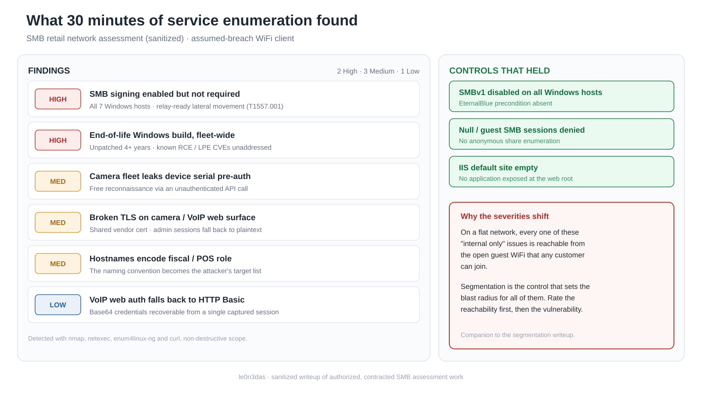

# The Fleet Behind the Flat Network: 30 Minutes of Service Enumeration in an SMB Retail Assessment

> A companion to [the segmentation writeup](../smb-network-segmentation/). The flat network was the finding that carried the engagement. This companion covers what that flat network exposed: the fleet-wide hygiene issues that a missing boundary turns from "internal attacker" problems into "any walk-in with a phone" problems.

**Author:** le0n3das · Security & infrastructure consultant (networks / Linux / SMB security)
**Type:** Internal network penetration test (assumed-breach, authenticated WiFi client)
**Client:** a multi-store auto-parts retailer (SMB) in Brazil, anonymized with the owner's consent

---

## Context

In the [previous writeup](../smb-network-segmentation/) I covered the critical finding: the public guest WiFi shared one broadcast domain with the payment and fiscal systems. Rating that Critical only makes sense if you know what it reached. This writeup covers the enumeration phase that inventoried the reachable fleet.

Nothing here is exotic. It is the ordinary state of a small business that grew its network one installer at a time: a handful of Windows point-of-sale and note-entry machines, an IIS host, and a large fleet of IP-camera recorders and VoIP phones from a single regional vendor. The point of the writeup is exactly that ordinariness. Most SMB retail networks look like this under the hood, and the remediation list barely changes between them.

All client-identifying data (names, IP addresses, MAC addresses, device serials, SSIDs, credentials, hostnames) has been removed or generalized. Methodology and remediation are preserved intact.

## Scope and rules of engagement

Same engagement as the segmentation writeup: authorized, contracted, assumed-breach from an authenticated WiFi client on a single RFC 1918 /24. Intrusion level was standard and non-destructive:

- No LLMNR/NBT-NS/mDNS poisoning, no NTLM relay, no brute force beyond a top-10 default-credential check.
- No exploit that could crash embedded/IoT devices (the camera and VoIP fleet is fragile by design; crashing a DVR just causes an outage with no security value).
- Allowed: ARP scan, `nmap` full TCP + top UDP, `smbmap`/`enum4linux-ng` with null/guest, service fingerprinting, default-credential tests on web admin panels.

**Toolchain:** a containerized Kali-based tooling stack with an active scope guard. For this phase: `nmap` (including the `smb2-security-mode` script), `netexec`, `curl`, and `enum4linux-ng`.

## Methodology

Phase 1 (discovery) had inventoried the live hosts on the flat /24 and bucketed them by role: Windows POS and note-entry workstations, one IIS/ASP.NET host, a camera DVR/NVR fleet, VoIP phones, and the WiFi controller. Phase 2 fingerprinted the services on the priority targets and triaged them for default credentials and known-bad configurations.

Findings are ordered by severity. I have kept the "positive controls" (things the network already did right) in, because a report that only lists problems is a report that lost the reader's trust.

## Findings

### HIGH-01: SMB signing enabled but not required, fleet-wide (7/7 Windows)

**Detection:** `nmap --script smb2-security-mode` returned `Message signing enabled but not required` on the sampled host; `netexec smb` confirmed `signing:False` on all seven Windows machines.
**MITRE ATT&CK:** T1557.001 (LLMNR/NBT-NS Poisoning and SMB Relay), T1187 (Forced Authentication)

When signing is enabled but not *required*, an attacker on the segment can coerce a host into authenticating against an attacker-controlled machine and relay that authentication to another host in the workgroup, inheriting credentials without cracking a single password. The relay vector itself was out of scope here (the rules of engagement prohibited Responder and NTLM relay), so it is reported as a configuration weakness rather than a demonstrated exploit. On a flat network with no domain and shared local accounts, it is the classic lateral-movement primitive.

**Remediation:** enforce `Microsoft network server: Digitally sign communications (always) = Enabled` on all Windows hosts. On a workgroup (no AD), this ships as a local security policy push on each host, since there is no domain GPO to apply it centrally.

### HIGH-02: End-of-life Windows build across the entire Windows fleet

**Detection:** all seven Windows hosts reported the same OS build, corresponding to a Windows 10 feature update that reached end of support in **December 2021**, over four years without security updates at assessment time.
**MITRE ATT&CK:** T1190 (Exploit Public-Facing Application), used here for lateral movement

Four years of unpatched Windows means dozens of unaddressed CVEs, including pre-auth and privilege-escalation classes (TLS/NEGOEX RCE, CLFS local privilege escalation, and others). On its own, an EOL workstation behind a firewall is a manageable risk. On the flat network from the first writeup, it is directly reachable from the guest SSID.

**Remediation:** bring the fleet to a supported build (Windows 10 22H2 as a bridge, or migrate to Windows 11). For an SMB, the practical blocker is usually the POS/ERP vendor's compatibility matrix rather than the upgrade itself, so this is a coordination task with the software vendor, on top of the IT work.

### MEDIUM-01: Camera fleet discloses device serial pre-authentication

**Detection:** the DVR/NVR web API responds to an unauthenticated login-initiation call by returning the device serial number in the authentication realm, plus a nonce, before any credentials are supplied. Confirmed on one recorder; the behavior is a vendor firmware default and applies to the whole fleet.
**MITRE ATT&CK:** T1592.002 (Gather Victim Host Information: Software)

A device serial works as a pivot: it enables firmware-version lookup against public vulnerability databases and traceability against the vendor's cloud portal. It is free reconnaissance handed to anyone who can reach port 80 on the recorder, which on a flat network is everyone.

**Remediation:** update device firmware, and restrict the recorders' management HTTP interface to a dedicated management network.

### MEDIUM-02: Broken TLS across the camera/VoIP HTTPS surface

**Detection:** four devices served an HTTPS certificate whose common name was the vendor's public marketing domain (a shared, never-rotated manufacturer certificate) rather than the device's own identity. Browsers reject it, so operators either accept the warning or fall back to plain HTTP.
**MITRE ATT&CK:** T1557 (Adversary-in-the-Middle)

The practical effect is that the HTTPS on these devices provides no identity guarantee, so admin sessions default to HTTP-redirect flows that expose the authentication nonce and session cookie to any adversary-in-the-middle on the segment.

**Remediation:** generate a per-device self-signed certificate (the vendor firmware supports it) and move management to a dedicated interface. A certificate no one can validate pushes every operator back onto plaintext. The TLS here protects nothing while giving operators false confidence that it does.

### MEDIUM-03: Hostnames encode business role and fiscal function

**Detection:** NetBIOS hostnames across the fleet encoded the machine's business function in plain language: which host is the cash register, which is the fiscal-note-entry workstation, which prints fiscal receipts.
**MITRE ATT&CK:** T1018 (Remote System Discovery)

This turns discovery into targeting. An attacker on the segment does not have to guess which of twenty hosts to phish or keylog; the hostname says "this is where fiscal documents are entered" and "this is the cash register." A descriptive scheme is convenient for the help desk. For an attacker on the segment, it is a ready-made list of which host to hit first.

**Remediation:** rename to a neutral scheme (e.g. `WS-001`, `WS-002`) and keep the role mapping in a private IT inventory, so the hostname broadcast to the whole segment stops carrying it.

### LOW-01: VoIP/recorder web auth falls back to HTTP Basic

**Detection:** the VoIP/recorder web interface offered HTTP Basic authentication over the (untrusted) TLS surface, while using Digest on plain HTTP, giving two inconsistent authentication surfaces on the same device.
**MITRE ATT&CK:** T1110 (Brute Force), credential capture

Basic transmits credentials base64-encoded on every request. Combined with the broken TLS above (MEDIUM-02), a single captured session recovers the password in cleartext.

**Remediation:** fix the device certificate (MEDIUM-02) and standardize on Digest.

### Positive controls (what the network already did right)

An honest report records the controls that held:

- **SMB null and guest sessions denied.** Null session returned `STATUS_ACCESS_DENIED` and guest returned `STATUS_LOGON_FAILURE` on every Windows host tested. No anonymous share enumeration.
- **SMBv1 disabled fleet-wide.** The classic EternalBlue precondition was absent on all seven Windows hosts.
- **The IIS host served an empty default site.** `GET /` returned `200 OK` with a zero-length body, so no application was exposed at the web root on the paths tested.

These matter for calibrating the report. The fleet was run by people applying sensible defaults wherever they knew to. The gaps are the ones an SMB has no in-house specialist to catch.

## Why this list is worse on a flat network

Read against the [segmentation finding](../smb-network-segmentation/), the severities shift. In isolation:

- SMB relay needs an attacker already on the segment.
- The EOL Windows CVEs need network reachability to the vulnerable host.
- The camera serial disclosure and Basic-auth capture need a position to sniff or reach the management plane.

Every one of those preconditions is "an attacker on the segment." The flat network grants that precondition to any customer who joins the open guest SSID. Segmentation is the control that decides who is even in scope to attempt the rest. That is why the segmentation gap is Critical and this list is High/Medium: the boundary sets the blast radius for everything behind it.

## Remediation, prioritized

**Immediate (this week)**
- Enforce SMB signing on all Windows hosts (local policy; no domain required).
- Restrict camera/VoIP management interfaces to a management network or VLAN.

**Short term (weeks)**
- Plan the Windows fleet upgrade to a supported build, coordinating with the POS/ERP vendor's compatibility matrix.
- Rename fiscal/POS hosts to a neutral scheme; keep roles in a private inventory.
- Replace shared-manufacturer certificates with per-device certs; standardize device auth on Digest.

**Medium term (months)**
- Fold this into the segmentation project from the first writeup. Once admin, employee, and guest are on separate L3 segments behind a stateful firewall, most of the findings above revert to "internal only," which is where they belong.

## Lessons

- **Enumeration is where you earn the severity rating.** The Critical finding was cheap to *find*; it was this phase that justified calling it Critical, by proving what a customer with a phone could actually reach.
- **Positive controls are part of the deliverable.** Telling the owner "SMBv1 is off and null sessions are denied, here is what still needs work" buys more trust than a wall of red. It also tells them their money on the last upgrade was not wasted.
- **For an SMB, the hard part of the fix list is sequencing it.** None of these fixes are technically difficult. The value a consultant adds is the order: what to do tonight for free, what needs the software vendor, and what waits for the segmentation project.

---

*This is a sanitized public writeup of authorized, contracted work. No real client names, addresses, IPs, MACs, serials, SSIDs, hostnames, or credentials appear. Methodology and remediation are preserved; identifying data is not.*
